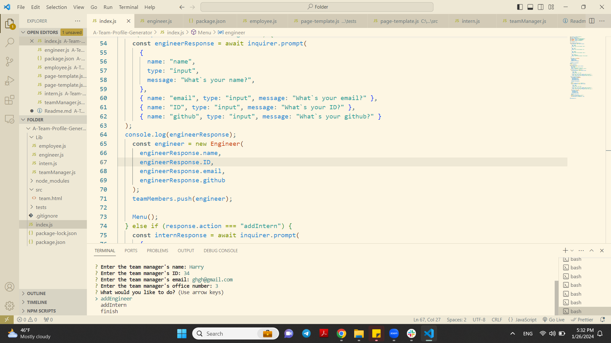

### Team Profile Generator
## Description
This project is a team profile generator that uses the technologies of Node, JS to implement all the set tasks. The user is prompted with questions in the terminal. The answers will be used to fill the HTML page that will then be generated by the app.
## Technologies used
HTML
JavaScript
Nodejs
Inquirer.js
## User Story
AS A manager
I WANT to generate a webpage that displays my team's basic info
SO THAT I have quick access to their emails and GitHub profiles
## Installation
1.First of all, a user needs to create a file management system which is built through the require fs command.
2.Another step is to install an inquierer. Inquierer is installed via npm init and then an npm install inquierer. 
3.The npm init installs a package.json and npm install inquierer installs a node modules package and a package lock json package. 
4.On the next line, a user needs to indicate a path where responses to the questions from index.js will go. 
5.Next Run npm i or npm install in order to download all the dependencies. 
6.Make sure to also download Inquirer.js by entering 'npm install inquirer' in your terminal in the root directory of the project. 
7.Run node index.js in your terminal to launch the application. 
8.To make sure the Jest tests work, run npm run test and inspect what the CLI returns.
## License
N/A
## Sources
Working on this project, I used such sources: https://developer.mozilla.org/en-US/docs/Web/JavaScript/Reference/Statements/async_function , https://stackoverflow.com/questions/3884281/what-does-the-function-then-mean-in-javascript , https://www.w3schools.com/js/js_async.asp , https://github.com/Marynaappliedl/Readme-generator/tree/main/local my code for a README generator and I was helped by the instructor Erik from the EDX platform. Also, I used git
## A Deployed code:

A link to my repository: https://github.com/Marynaappliedl/A-Team-Profile-Generator